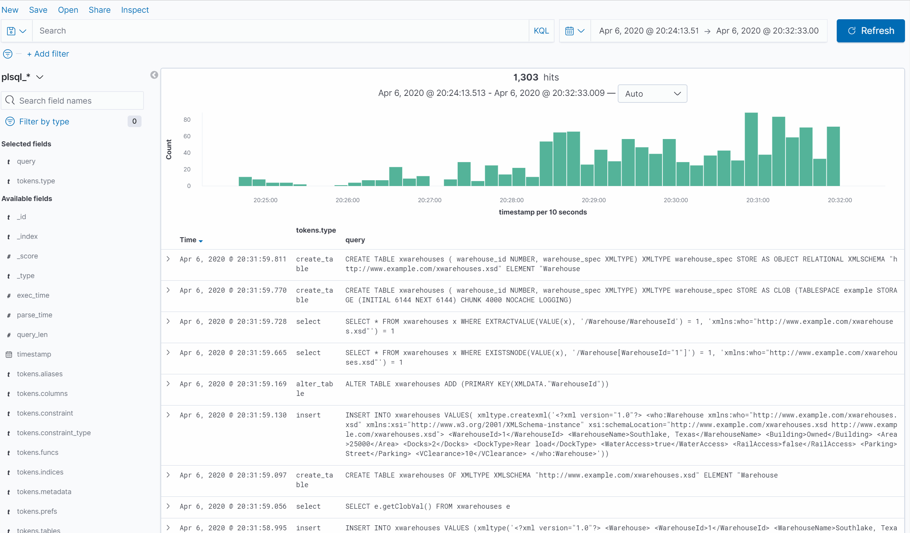
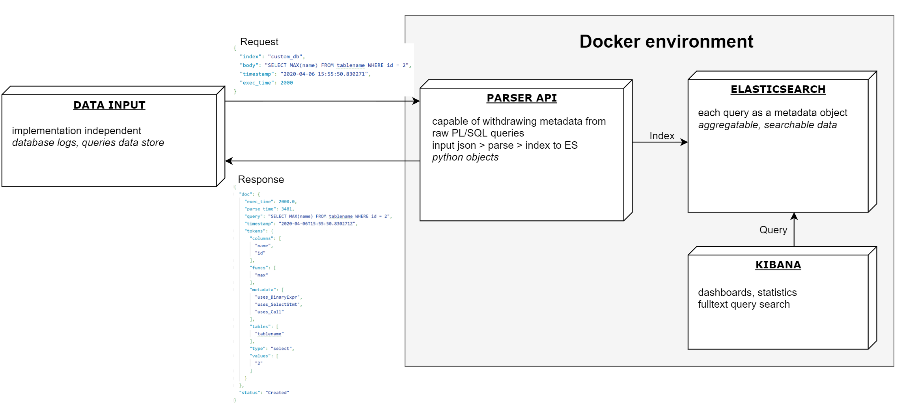

# Bachelor thesis: PL/SQL Analysis
Matěj Čermák
## Abstract
The goal of this thesis is to build standalone platform to facilitate PL/SQL query analysis.  
Core of the project is a ANTLR based parser that has an ability to extract useful **metadata (tables, columns, keywords used)** from the queries.  
The resulting objects are then indexed to Elasticsearch which allows one to explore the data in Kibana using its features like **dashboards, search, filtering** and much more.
### Possible use cases
Project can be integrated in your solution, consult the [Architecture](###-Architecture) section for more.
* **Datastore analysis** - Large amounts of data can be indexed into Elasticsearch (with proper cluster management). Therefore one can load large datasets and explore the data in a structured way.
* **Optimizing queries** - When information about execution time of the query is provided to the API, one can discover queries with poor performance and optimize/avoid using them.
* **Time-based analysis** - Query objects in Elastic carries information about time as well, that can be valuable when tracking down the source of high database load or simply just to visualize the amount of incoming queries over time. Useful as well when trying to locate queries that were executed in the certain time period.
## Features
### Kibana > Dashboards
Some of the projects default visualizations & dashboards are loaded to Kibana automatically, but various other can be made easily.  
Dasboards can be listed by clicking [Dashboards] in the left panel.

### Kibana > Discover
Discover allows you to explore your data more in-depth, various searches can be made on the data in no time. Discover as well offers filtering based on categorical columns or time. Try it by clicking [Discover] on the left panel.
  
Refer to elastic documentation [here](https://www.elastic.co/guide/en/kibana/current/search.html), which might help you to customize your searches in Kibana. Here are some examples of useful searches.

`employee` - basic fulltext search

`"FROM employee"` - search literal part of the query

`tokens.metadata :"uses_SortBy"` - queries that use SORT BY clause

`tokens.columns : "employee_id"` - queries that use column
## Prerequisites
Project utilizes [Docker compose](https://docs.docker.com/compose/) to run all the services needed. See the individual components description if you want to use it for your own project.
* Docker installation with at least 3GB of RAM - see [Docker docs](https://docs.docker.com/).
## Usage
```bash
cd ./src
docker-compose up -d
```
After all services starts, they can be accessed here:
* API endpoint - [localhost:8080](http://localhost:8080)
* Kibana - [localhost:5601](http://localhost:5601)
* Elasticsearch - [localhost:9200](http://localhost:9200)
## Architecture

### Parser API
Data input was left for one to implement for particular use-case, therefore project provides an API endpoint where the raw queries can be send.
That means you can easily integrate it in your application.
Feel free just to run the parser and integrate it with your running ES cluster by starting only its service via docker compose or use APIs dockerfile included.
API was done with the help of [Swagger](https://swagger.io/) and its code-generation tools and its running on [Flask](https://flask.palletsprojects.com/en/1.1.x/).
Documentation for the API can be found [here](src/rest/parser_api/swagger/swagger.yaml).
### Elasticsearch
[Elasticsearch](https://www.elastic.co/) is a distributed search-engine based on Lucene and together with Kibana it happened to be a perfect tool for this purpose.
I left ES with default settings and only a single node, but docker files can be easily extended with cluster of nodes.
Consult [sebp/elk documentation](https://elk-docker.readthedocs.io/) for more information.
## Development process
### Optimizing parser
Parser is based on [ANTLR PL/SQL](https://github.com/datacamp/antlr-plsql) project which utilizes PL/SQL grammar for ANTLR and builds relation trees from queries. Goal of the project was to process resulting tree and extract only the valuable information.
Since any grammar is not 100% accurate (non-standard syntax used, unsupported keywords when query language develop, combined queries etc.) the has been some pitfalls when processing the tree and a lot of logic had to be implemented. 
Some complex queries took really long time to process and were blocking the pipeline, therefore I confirmed on the testing dataset my assumption that there is a correlation between length and processing time, so I decided to drop 
### Testing
After I made the first prototype I started writing tests using [pytest](https://docs.pytest.org/en/latest/). I simply made up various queries and the defined the expected value of the metadata for them.
Later when I tested sufficient amount of queries I used larger datasets containing various queries to test the parser and checking the output manually.
### Dataset crawler
Finding perfect dataset to test the parser, one that contains variety of queries as well as large enough dataset for analysis purposes, was not a easy task.
For that purpose I made simple web crawler, that can crawl all the query examples from whole PL/SQL Oracle documentation and clean the data before sending bulk to API for testing purposes.
For cleaning I used basic methods for string maniplation (striping, joining, removing) and then filtering the dataset using predefined keywords. 
***
## Developer notes
##### Links
* [ANTLR notes](https://github.com/antlr/antlr4/blob/master/doc/python-target.md)
* [ANTLR grammars](https://github.com/antlr/grammars-v4)
* [ANTLR plsql project](https://github.com/datacamp/antlr-plsql)
* [ANTLR tutorial](https://tomassetti.me/antlr-mega-tutorial/)
* [ANTLR ast project](https://github.com/datacamp/antlr-ast)
##### Building ANTLR grammar
[Antlr JAR library](https://www.antlr.org/download/antlr-4.8-complete.jar)
```
java -jar antlr-4.8-complete.jar -Dlanguage=Python3 -o antlr_py/ -visitor plsql.g4
```
