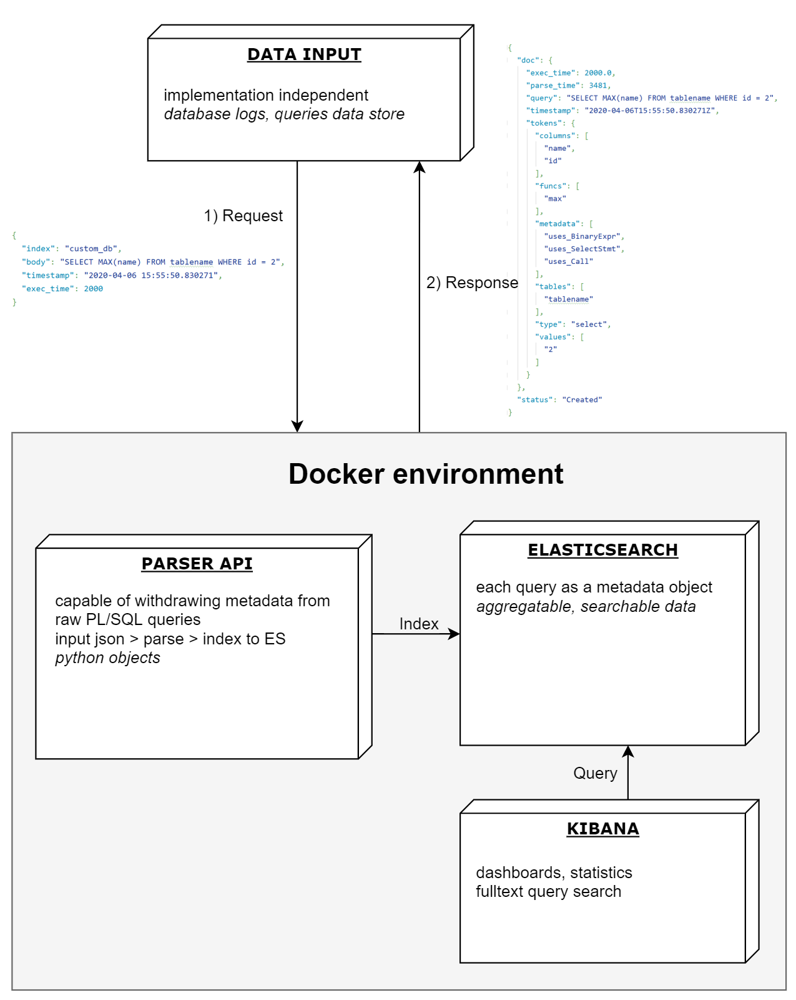

# Bachelor thesis: PL/SQL Analysis
###### Matěj Čermák
### Abstract
The goal of this thesis is to build standalone platform to facilitate PL/SQL query analysis.
Core of the project is a ANTLR based parser that has an ability to extract useful **metadata (tables, columns, keywords used)** from your queries.
The object metadata is then indexed to Elasticsearch which allows one to explore the data in Kibana using its features like **dashboards, search, filtering** and much more.
Some of the projects default visualizations & dashboards are loaded to Kibana automatically, but various other can be made easily.
#### Possible use cases
* **datastore analysis** - Large amounts of data can be indexed into Elasticsearch (with proper cluster management). Therefore one can load large datasets and allow users explore data in a structured way.
* **optimizing queries** - When data about execution time of the query is provided, one can discover queries with poor performance and optimize/avoid them.
* **time-based analysis** - Query objects in ES holds time information as well, which can be valuable when tracking down the source of high database load or simply just to visualize the amount of incoming queries over time.
### Usage
#### Kibana > Dashboards
Various project dashboards are preloaded to kibana to help you explore your data.
They can be listed by clicking [Dashboards] in the left panel. 


#### Kibana > Discover


Refer to elastic documentation [here](https://www.elastic.co/guide/en/kibana/current/search.html), which might help you to customize your searches in Kibana. Here are some examples of useful searches.

`employee` - basic fulltext search

`"FROM employee"` - search literal part of the query

`tokens.metadata :"uses_SortBy"` - queries that use SORT BY clause

`tokens.columns : "employee_id"` - queries that use column

### Architecture
Project utilizes [Docker compose](https://docs.docker.com/compose/) to run all the services needed. It requires at least 3GB of RAM. See [sebp/elk documentation](https://elk-docker.readthedocs.io/) for more information.


#### API
Data input was left for one to implement for particular use-case, therefore project provides an API endpoint where the raw queries can be send.
Documentation for the API can be found [here](src/rest/parser_api/swagger/swagger.yaml) 
#### Elasticsearch
Elasticsearch is a distributed search-engine based on Lucene and together with Kibana it happened to be a perfect tool for this purpose.
#### Parser antlr-tree, how it works
#### Dataset crawler
Finding perfect dataset to test the parser, one that contains variety of queries as well as large enough dataset for analysis purposes, was not a easy task.
For that purpose I made simple web crawler, that can crawl all the query examples from whole PL/SQL Oracle documentation.
### Caveats
* optimizing parser
* cleaning crawler
* drop queries with more than 1000 chars (based on dataset)

todo: scaling ES for bigger solutions

***
### Developer notes
##### Links
* [ANTLR notes](https://github.com/antlr/antlr4/blob/master/doc/python-target.md)
* [ANTLR grammars](https://github.com/antlr/grammars-v4)
* [ANTLR plsql project](https://github.com/datacamp/antlr-plsql)
* [Antlr tutorial](https://tomassetti.me/antlr-mega-tutorial/)
* [ANTLR ast project](https://github.com/datacamp/antlr-ast)
##### Building ANTLR grammar
[Antlr JAR library](https://www.antlr.org/download/antlr-4.8-complete.jar)
```
java -jar antlr-4.8-complete.jar -Dlanguage=Python3 -o antlr_py/ -visitor plsql.g4
```
### TODOS
* multiple tables - selecting column without defining table ???
* generate the grammar on demand

#### Problematic queries
* column name in CHECK missing completely from the tree
`ALTER TABLE suppliers ADD CONSTRAINT check_supplier_name   CHECK (supplier_name IN ('IBM', 'Microsoft', 'NVIDIA'))`